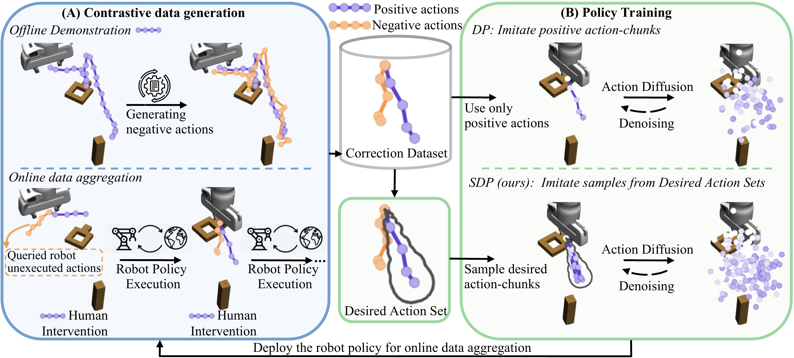

# Set-Supervised Diffusion Policy: Learning Action-Chunking Diffusion through Corrections 

[](https://set-supervised-diffusion-policy.github.io/)
[](https://arxiv.org/abs/2606.01865)
[](https://huggingface.co/spaces/Zhaoting123/Hdf5_data_visualization)



---

<a id="overview"></a>

## 🧭 Overview

This repository provides the official implementation of **SDP** (Set-Supervised Diffusion Policy: Learning Action-Chunking Diffusion through Corrections), a framework that trains diffusion policies using contrastive positive-negative action-chunk pairs, improving robustness to noisy data and data efficiency in interactive imitation learning.
It includes baselines such as Diffusion Policy, Ambient Diffusion, Diffusion-DPO, CLIC, and IBC.

<a id="table-of-contents"></a>

## 📚 Table of Contents

- [Installation](#installation)
- [Quickstart](#quickstart)
- [Repository layout](#repository-layout)
- [Usage for simulation experiments](#usage-for-simulation-experiments)
  - [Online Interactive Learning](#online-interactive-learning)
  - [Offline Learning](#offline-learning)

- [Usage for Real-Robot Experiments](#usage-for-real-robot-experiments)
- [Acknowledgements](#acknowledgements)
- [Citation](#citation)


<a id="installation"></a>

## 🛠️ Installation

We support **conda**, **poetry**, **docker**, and **apptainer**. The code has been tested on Ubuntu 22.04 and 24.04.

### Conda
You can use our conda environment YAML file to create the env:
```bash
cd Files/src/
conda env create -f environment.yml
# If issues occur, update:
conda env update -n conda-env-SDP -f environment.yml --prune
```

> ⚠️ Torch version may depend on your GPU. For newer GPUs (e.g., RTX 5070Ti), adjust `environment.yml`.

### Poetry

The Poetry configuration is in `Files/src/pyproject.toml`. Create it with:
```bash
cd Files/src/
poetry install
```

After installation, activate it with:
```bash
cd Files/src/
poetry shell
```

### Docker

Docker is used for real-robot experiments because it includes the required ROS 1 dependencies.
Build the SDP image from the repository root:
```bash
cd Files
sudo docker build -t sdp-image -f dockerfile_SDP .
```

The Dockerfile uses `zhaoting123/franka_robot_docker:v1` as the base image by default. If you already have the base image locally under another tag, override it with:
```bash
cd Files
sudo docker build \
  --build-arg SDP_BASE_IMAGE=franka_robot_docker:v1 \
  -t sdp-image \
  -f dockerfile_SDP .
```

Run the SDP container with a bind mount so your local `Files/src` directory is available at `/app` inside the container:
```bash
cd Files
sudo docker run -it \
  --gpus=all \
  --net=host \
  --env="NVIDIA_DRIVER_CAPABILITIES=all" \
  --env="DISPLAY" \
  --env="QT_X11_NO_MITSHM=1" \
  --volume="/tmp/.X11-unix:/tmp/.X11-unix:rw" \
  --volume="$(pwd)/src:/app:rw" \
  sdp-image bash
```


### Apptainer

Pull the [pre-built SDP Apptainer image](https://hub.docker.com/repository/docker/zhaoting123/clic-env/general).
You could also build the image from the repository root:

```bash
cd Files
apptainer build --fakeroot SDP_nvidia.sif apptainer_SDP.def
```

Use the container with NVIDIA support enabled. The image already sets the working directory to `/opt/sdp/src`, so you can run the training entrypoints directly:

```bash
cd Files
apptainer exec --nv --bind "$PWD/src:/opt/sdp/src" SDP_nvidia.sif \
python /opt/sdp/src/main-receding_horizon.py \
  --config-name train_CLIC_Diffusion_image_Ta8 \
  hydra.run.dir='outputs/${experiment_id}' \
  +GENERAL.render_savefig_flag=false
```


<a id="quickstart"></a>

## 🚀 Quickstart

Run a simple 2D point-to-goal task:

```bash
python main-receding_horizon.py --config-name=train_Set_Supervised_Diffusion_low_dim_Ta8 \
task=line_following \
+GENERAL.render_savefig_flag=true
```

<a id="repository-layout"></a>

## 🗂️ Repository layout

| Path | Description |
| --- | --- |
| `Files/src/main-receding_horizon.py` | Simulation training/evaluation entrypoint |
| `Files/src/main-real-robot.py` | Real-robot entrypoint |
| `Files/src/agents/` | Policy and baseline implementations |
| `Files/src/env/` | Simulation and real-robot env wrappers |
| `Files/src/tools/` | Buffers, feedback, helpers |
| `Files/src/config/` | Hydra configs for simulation |
| `Files/src/config_real/` | Hydra configs for real robot |

<a id="usage-for-simulation-experiments"></a>

## 🌍 Usage for simulation experiments

### Online Interactive Learning
Run algorithms with:

```bash
python main-receding_horizon.py --config-path='config/exp_accurate_interactive' --config-name=train_Circular_Set_Supervised_Diffusion_image_Ta8
```


Config files for all algorithms are in `Files/src/config/`. An introduction of the file `main-receding_horizon.py` is provided in [this document](./Files/doc/Readme_training_pipeline.md).
Override the task directly in the command. Task configs live in `Files/src/config/exp_accurate_interactive/task/`, for example `square_image_abs`, `pickcan_image_abs`, `pushT_abs`, and `twoArmLift_image_abs`:

```bash
python main-receding_horizon.py \
  --config-path='config/exp_accurate_interactive' \
  --config-name=train_Circular_Set_Supervised_Diffusion_image_Ta8 \
  task=pickcan_image_abs
```

To simulate noisy corrective feedback, enable Gaussian teacher noise with a Hydra override:

```bash
python main-receding_horizon.py \
  --config-path='config/exp_accurate_interactive' \
  --config-name=train_Circular_Set_Supervised_Diffusion_image_Ta8 \
  GENERAL.oracle_teacher_Gaussian_noise=true
```

You can also use the preset noisy-feedback configs under `Files/src/config/exp_noisy_demo_interactive/`:

```bash
python main-receding_horizon.py \
  --config-path='config/exp_noisy_demo_interactive' \
  --config-name=train_Circular_Set_Supervised_Diffusion_image_Ta8 
```

Online experiment outputs are written under the Hydra run directory. If you run from
`Files/src`, this is usually `Files/src/outputs/<date>/<time>/`; for easier lookup,
you can set:

```bash
hydra.run.dir='outputs/${experiment_id}'
```

Then the experiment run directory is `Files/src/outputs/<experiment_id>/`.
Inside one online IIL run, the main logs and artifacts are:

| Artifact | Location |
| --- | --- |
| TensorBoard logs | `<run_dir>/saved_data/repetition_000/logs/` |
| Evaluation results CSV | `<run_dir>/results/<experiment_id>_0.csv` |
| Saved policy/checkpoints and optional online replay buffer | `<run_dir>/saved_data/repetition_000/` |
| Trajectory dataset, when `GENERAL.record_traj_dataset=true` | `<run_dir>/trajectory_buffer_0.hdf5` |

View TensorBoard from `Files/src` with:

```bash
tensorboard --logdir outputs/<experiment_id>/saved_data/repetition_000/logs
```

For image-observation tasks, enable trajectory recording with:

```bash
python main-receding_horizon.py \
  --config-path='config/exp_accurate_interactive' \
  --config-name=train_Circular_Set_Supervised_Diffusion_image_Ta8 
  GENERAL.record_traj_dataset=true 
```

Inspect the recorded image trajectory from `Files/src` with:

```bash
python script/visualize_traj_buffer_data_hdf5.py --buffer-path outputs/<experiment_id>/trajectory_buffer_0.hdf5 
```


---
### Offline Learning

Offline training expects a trajectory dataset in SDP HDF5 format. 
You can preview HDF5 datasets before downloading them with this [Hugging Face Space](https://huggingface.co/spaces/Zhaoting123/Hdf5_data_visualization).
Released correction datasets are available from Hugging Face:

| Task | Dataset | Download |
| --- | --- | --- |
| Square correction | Robosuite Square image absolute dataset with state | [Download from Hugging Face](https://huggingface.co/datasets/Zhaoting123/Robosuite_Square_image_abs_with_state/tree/main/20260410_205606_Diffusion_CLIC_intervention_Circular_square_image_abs_Ta16_offlineFalse_Scale0.01) |
| PickCan correction | Robosuite PickCan image absolute dataset with state | [Download from Hugging Face](https://huggingface.co/datasets/Zhaoting123/Robosuite_PickCan_image_abs_with_state/blob/main/SDP_Pickcan_image_abs/trajectory_buffer_0.hdf5) |


To run the Square correction dataset, download `trajectory_buffer_0.hdf5` from the Square correction Hugging Face link above and place it at:

```text
Files/src/outputs/square_dataset_SDP/trajectory_buffer_0.hdf5
```

From `Files/src`, inspect the downloaded dataset with:
```bash
python script/visualize_traj_buffer_data_hdf5.py \
  --buffer-path outputs/square_dataset_SDP/trajectory_buffer_0.hdf5 \
  --img-key agentview_image
```

Then train a policy offline with the dataset path override:

```bash
python main-receding_horizon.py \
  --config-path='config/exp_offline' \
  --config-name=train_Circular_Set_Supervised_Diffusion_image_abs_Ta8 \
  AGENT.buffer_dataset_path=outputs/square_dataset_SDP/trajectory_buffer_0.hdf5
```

For other datasets, replace `AGENT.buffer_dataset_path` with the local path to the downloaded SDP HDF5 file.


### Simulation Environments

We use:

* **[Robosuite](https://github.com/ARISE-Initiative/robosuite)** (main experiments)
* **[Metaworld](https://github.com/Farama-Foundation/Metaworld)** (debugging)

For Metaworld (old simulator version), ensure:

```bash
export LD_LIBRARY_PATH=$LD_LIBRARY_PATH:/home/<user>/.mujoco/mujoco210/bin
export LD_LIBRARY_PATH=$LD_LIBRARY_PATH:/usr/lib/nvidia
export LD_PRELOAD=/usr/lib/x86_64-linux-gnu/libGLEW.so
```


<a id="usage-for-real-robot-experiments"></a>

## 🤖 Usage for Real-Robot Experiments

This section describes the recommended workflow for running real-robot experiments with the Franka manipulator.

Before running any experiment, please follow the step-by-step instructions in [this document](https://github.com/ZhaotingLi/franka_docker/blob/fr3/docs/franka_exp_steps_to_follow.md) for conducting experiments with the Franka manipulator.


### Experiment Workflow Overview

The real-robot learning pipeline follows an iterative workflow:

```text
1. Collect offline demonstrations
        ↓
2. Offline training with SDP
        ↓
3. Deploy SDP with online IIL and collect a correction dataset

4. Offline training with SDP using the updated dataset
        ↓
5. Deploy SDP with online IIL and collect corrections again
        ↓
6. Repeat steps 4–5 as needed
```

In summary, the workflow alternates between **offline training** and **online interactive imitation learning (IIL)**. Each online IIL round produces additional correction data, which is then used to improve the policy in the next offline training stage.


### 1. Data Collection

Use the following command to collect offline demonstration data:

```bash
python main-real-robot.py \
    --config-path='config_real' \
    --config-name=train_Set_Supervised_Diffusion_image_Ta8 \
    AGENT.offline_data_collection=true
```

The collected demonstrations will be saved as an offline dataset. This dataset is used for the first offline training stage.

The offline demonstration data need to be transferred into a correction dataset; see
[`Files/src/script/hdf5_traj_process/README.md`](Files/src/script/hdf5_traj_process/README.md)
for the HDF5 trajectory processing workflow.

### 2. Offline Training

Before starting offline training, specify the dataset path in the configuration file using:

```yaml
buffer_dataset_path: <path_to_dataset>
```

Then run:

```bash
python main-real-robot.py \
    --config-path='config_real' \
    --config-name=train_Set_Supervised_Diffusion_image_Ta8_offline
```

This stage trains an SDP policy from the collected offline demonstrations.

---

### 3. Online Interactive Learning and Correction Data Collection

Before running online interactive imitation learning, specify the checkpoint path in the configuration file using:

```yaml
load_dir: <path_to_checkpoint>
```

Then deploy the trained policy with online IIL:

```bash
python main-real-robot.py \
    --config-path='config_real' \
    --config-name=train_Set_Supervised_Diffusion_image_Ta8
```

During online IIL, the trained policy is deployed on the real robot. Human corrections are collected during execution and saved as a correction dataset.


<a id="acknowledgements"></a>

## 🙏 Acknowledgements

This code builds on and adapts:

* [CLIC](https://github.com/clic-webpage/CLIC)
* [Diffusion Policy](https://github.com/real-stanford/diffusion_policy)
* [DiffusionDPO](https://github.com/SalesforceAIResearch/DiffusionDPO)
* [IBC](https://github.com/google-research/ibc) (MCMC sampling, baseline)
* [Ambient Diffusion](https://github.com/giannisdaras/ambient-diffusion)
* [Robosuite](https://github.com/ARISE-Initiative/robosuite)
* [Robomimic](https://github.com/ARISE-Initiative/robomimic)
* [Metaworld](https://github.com/Farama-Foundation/Metaworld)


<a id="citation"></a>

## 📄 Citation
If you find this repository useful for your research, please consider citing the following paper:

```
@inproceedings{RSS2026_SDP,
  title={Set-Supervised Diffusion Policy: Learning Action-Chunking Diffusion through Corrections},
  author={Li, Zhaoting and Chen, Gang and Alonso-Mora, Javier and Della Santina, Cosimo and Kober, Jens},
booktitle={Robotics: Science and Systems 2026},
year={2026},
}
```

<a id="license"></a>

## ⚖️ License

This project is licensed under the MIT License - see the [LICENSE](LICENSE) file for details.
